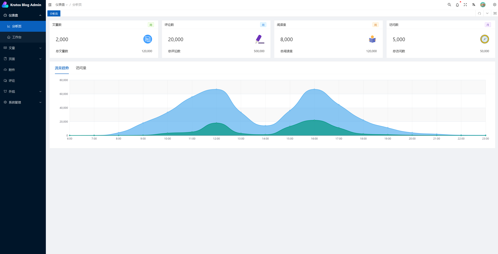
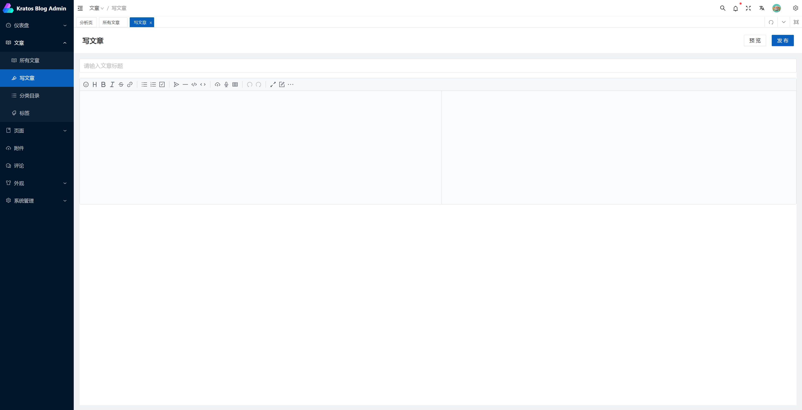

# 克拉托斯博客 - 后台管理系统 - Kratos Blog Admin

一个Golang的博客系统/CMS。

- 后端基于 [golang](https://go.dev/) + [go-kratos](https://go-kratos.dev/)
- 前端基于 [VUE3](https://vuejs.org/) + [TypeScript](https://www.typescriptlang.org/)

## 技术栈

- [TypeScript](https://www.typescriptlang.org/)
- [Vite](https://vitejs.dev/)
- [Vue3](https://v3.vuejs.org/)
- [Pinia](https://pinia.vuejs.org/)
- [Ant-Design-Vue](https://2x.antdv.com/docs/vue/introduce-cn/)
- [Vben Admin](https://vben.vvbin.cn/#/)

## 安装使用

- 安装依赖库

```bash
pnpm install
```

- 运行

```bash
pnpm serve
```

- 编译

```bash
pnpm build
```

## API & Mock

使用国产货Apifox来做API管理和Mock Server

- API地址：<https://www.apifox.cn/apidoc/shared-9190e67c-9d76-4536-8046-a4aa05425e4a>
- Mock地址：<https://mock.apifox.cn/m1/1701635-0-default>

## 后台截图

- 登陆界面


- 分析页面



- 博文列表


- 写文章



- 评论列表


